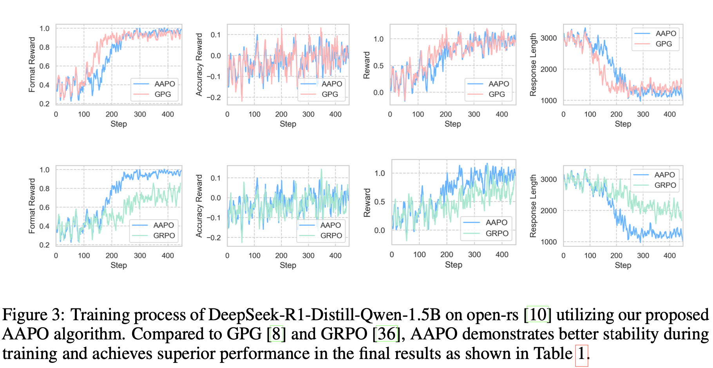

# AAPO: Enhance the Reasoning Capabilities of LLMs with Advantage Momentum

## 🔗 Links
- 📄 **Paper**: [ArXiv](https://arxiv.org/abs/2505.14264)
- 🤗 **Model**: 
[AAPO-1.5B](https://huggingface.co/jianxxiong/AAPO-1.5B)
[AAPO-7B](https://huggingface.co/jianxxiong/AAPO-7B)

## 📝 Introduction
In this paper, we propose Advantage-Augmented Policy Optimization (AAPO), a novel RL algorithm
that optimizes the cross-entropy (CE) loss using advantages enhanced through a momentum-based estimation scheme. AAPO effectively mitigates the
inefficiencies associated with group relative advantage estimation. Experimental
results on multiple mathematical reasoning benchmarks demonstrate the superior
performance of AAPO.

Here are the main experimental results in our paper. More results about ablation study can be found in our paper.





## 🚀 Training process

### Environment setup
for training
```bash
conda create -n train python=3.11
conda activate train
pip install -r train_requirements.txt
```

for evaluattion
```bash
conda create -n eval python=3.11
conda activate eval
pip install -r eval_requirements.txt
```

### Training
```bash
cd open-rs
bash train.sh
```

## 📊 evaluattion
evaluation on single benckmark
```bash
bash single_eval.sh
```

evaluation on all benchmarks
```bash
bash auto_eval.sh
```

## 📚 Citation
If you get any thing useful from this work, please cite:
```bibtex
@article{xiong2025aapo,
  title={AAPO: Enhance the Reasoning Capabilities of LLMs with Advantage Momentum},
  author={Xiong, Jian and Zhou, Jingbo and Ye, Jingyong and Dou, Dejing},
  journal={arXiv preprint arXiv:2505.14264},
  year={2025}
}
```

## 🙏 Acknowledge
We are grateful for the foundational code provided by [SimpleRL-Reason](https://github.com/hkust-nlp/simpleRL-reason), [open-rs](https://github.com/knoveleng/open-rs) and [GPG](https://github.com/AMAP-ML/GPG). Utilizing their resources implies agreement to their respective licenses. Our project benefits greatly from these contributions, and we acknowledge their significant impact on our work.