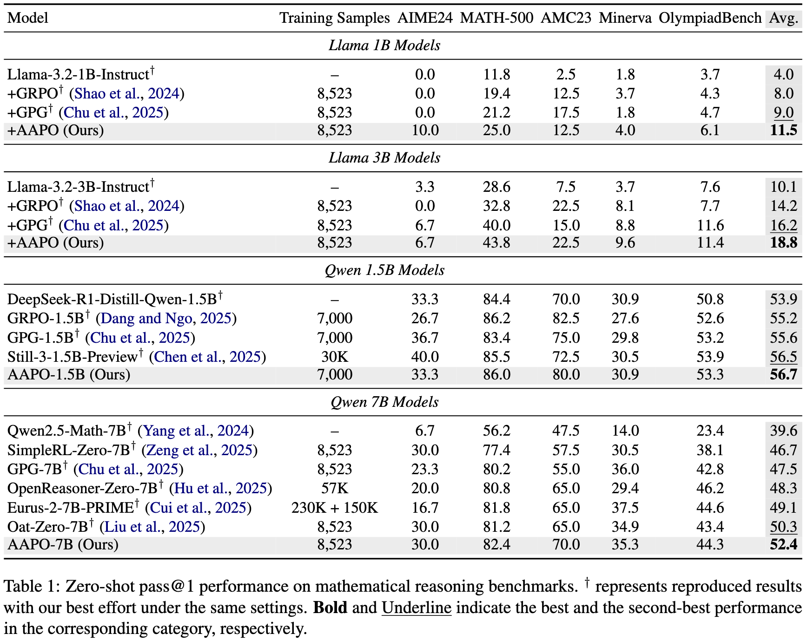
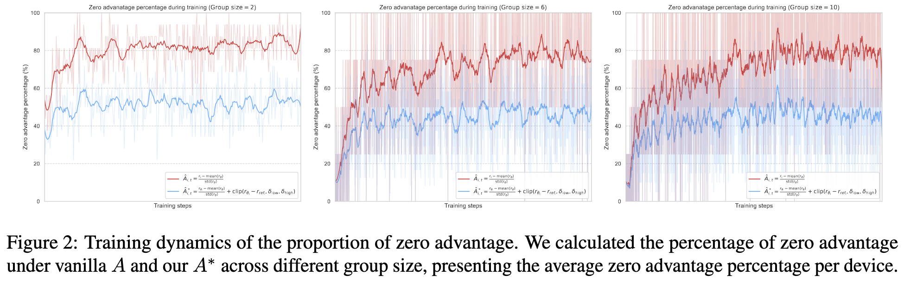

# AAPO: Enhancing the Reasoning Capabilities of LLMs with Advantage Margin

**Advantage-Augmented Policy Optimization (AAPO)** — RL training algorithm that optimizes cross-entropy loss using advantages refined by a margin-based estimation scheme, reducing inefficiencies from group relative advantage estimation.

---

## Paper

| | |
| --- | --- |
| **Title** | AAPO: Enhancing the Reasoning Capabilities of LLMs with Advantage Margin |
| **Venue** | ACL 2026 Main Conference|
| **ArXiv** | [2505.14264](https://arxiv.org/abs/2505.14264) |
| **Authors** | $\text{Jian Xiong}$, $\text{Jingbo Zhou}^{\dagger}$, $\text{Jingyong Ye}$, $\text{Qiang Huang}$, $\text{Dejing Dou}^{\dagger}$ |
| **Models** | [Huggingface](https://huggingface.co/collections/jianxxiong/aapo) |

---

## Introduction

We propose **AAPO**, a novel RL algorithm for enhancing LLMs' reasoning capabilities. Experiments across multiple benchmarks and model families show consistent gains over strong baselines.

### Main results

Benchmark performance and statistical analysis of the zero advantage proportion during training:





For training stability, convergence, ablations, OOD behavior, and training dynamics, please see the full paper.

---

## Repository layout

| Directory | Typical use |
| --- | --- |
| [`open-rs/`](open-rs) | Train **DeepSeek-R1-Distill-Qwen-1.5B** |
| [`open-r1/`](open-r1) | Train **Qwen2.5-Math-7B**, **Llama** (with config tweaks below), evaluation scripts |

Shared dependency list: [`requirements.txt`](requirements.txt).

---

## Quick start

### 1. Environment

```bash
conda create -n train python=3.11
conda activate train
pip install -r requirements.txt
```

### 2. Training

**DeepSeek-R1-Distill-Qwen-1.5B**

```bash
cd open-rs
bash train.sh
```

**Qwen2.5-Math-7B**

```bash
cd open-r1
bash train.sh
```

**Llama series**

In `train.sh`, set `max_completion_length=3072` and `max_prompt_length=1024`. In the config, set `dataset_name` to `SimpleRL-Zoo-Data/simplelr_abel_level3to5` and clear the system prompt. Then:

```bash
cd open-r1
bash train.sh
```

### 3. Evaluation

**Qwen series** — run inside the same tree you used for training (`open-r1` for Qwen2.5-Math-7B / Llama configs, `open-rs` for DeepSeek-R1-Distill-Qwen-1.5B).

Single benchmark:

```bash
cd open-r1   # or: cd open-rs
bash single_eval.sh
```

All benchmarks:

```bash
cd open-r1   # or: cd open-rs
bash auto_eval.sh
```

**Llama series**

Follow the evaluation setup in [SimpleRL-Reason](https://github.com/hkust-nlp/simpleRL-reason).

---


## Citation

If you find this work useful, please cite:

```bibtex
@inproceedings{
xiong2026aapoenhancingreasoningcapabilities,
title={AAPO: Enhancing the Reasoning Capabilities of LLMs with Advantage Margin},
author={Xiong, Jian and Zhou, Jingbo and Ye, Jingyong and Huang, Qiang and Dou, Dejing},
booktitle={The 64th Annual Meeting of the Association for Computational Linguistics},
year={2026}
}
```

---

## Acknowledgments

We thank the authors of [SimpleRL-Reason](https://github.com/hkust-nlp/simpleRL-reason), [open-rs](https://github.com/knoveleng/open-rs), and [GPG](https://github.com/AMAP-ML/GPG) for foundational code. Use of their resources is subject to their respective licenses.


---


## Contact

If you have any questions, please contact: jianxiong_ AT outlook DOT com.
