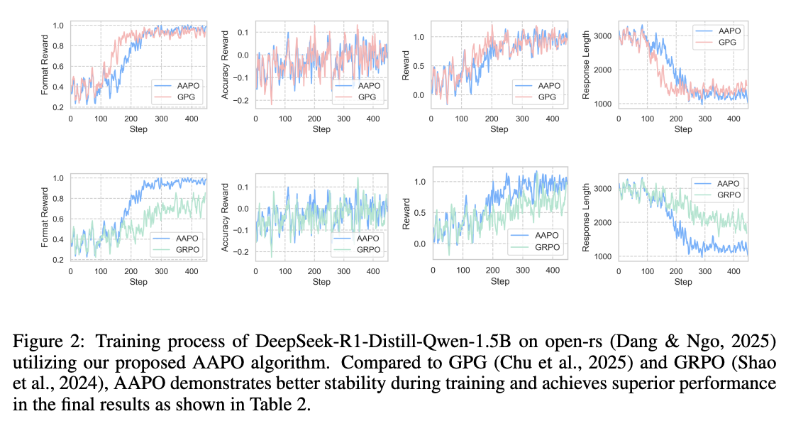

# [AAPO: Enhancing the Reasoning Capabilities of LLMs with Advantage Momentum](https://arxiv.org/abs/2505.14264v2)

## Introduction
In this paper, we propose Advantage-Augmented Policy Optimization (AAPO), a novel RL algorithm
that optimizes the cross-entropy (CE) loss using advantages enhanced through a momentum-based estimation scheme. AAPO effectively mitigates the
inefficiencies associated with group relative advantage estimation. Experimental
results on multiple mathematical reasoning benchmarks and model series demonstrate the superior
performance of AAPO.

Here are the main experimental results in our paper. More results about ablation study can be found in our paper.





## Environment setup
## Training environment
```bash
conda create -n train python=3.11
conda activate train
pip install -r train_requirements.txt
```

## Evaluation environment
```bash
conda create -n eval python=3.11
conda activate eval
pip install -r eval_requirements.txt
```

## Training
Train DeepSeek-R1-Distill-Qwen-1.5B model
```bash
cd open-rs
bash train.sh
```

Train Qwen2.5-Math-7B model
```bash
cd open-r1
bash train.sh
```

Train Llama series models

Set max_completion_length=3072, max_prompt_length=1024 in train.sh, and set dataset_name to SimpleRL-Zoo-Data/simplelr_abel_level3to5 in config file and clear the system prompt.

```bash
cd open-r1
bash train.sh
```

## Evaluation
### Evaluate Qwen series models
evaluation on single benckmark
```bash
bash single_eval.sh
```

evaluation on all benchmarks
```bash
bash auto_eval.sh
```

### Evaluate Llama series models
You can refer to this repo [SimpleRL-Reason](https://github.com/hkust-nlp/simpleRL-reason).

## 📚 Citation
If you get any thing useful from this work, please cite:
```bibtex
@misc{xiong2025aapoenhancingreasoningcapabilities,
      title={AAPO: Enhancing the Reasoning Capabilities of LLMs with Advantage Momentum}, 
      author={Jian Xiong and Jingbo Zhou and Jingyong Ye and Qiang Huang and Dejing Dou},
      year={2025},
      eprint={2505.14264},
      archivePrefix={arXiv},
      primaryClass={cs.LG},
      url={https://arxiv.org/abs/2505.14264}, 
}
```

## 🙏 Acknowledge
We are grateful for the foundational code provided by [SimpleRL-Reason](https://github.com/hkust-nlp/simpleRL-reason), [open-rs](https://github.com/knoveleng/open-rs) and [GPG](https://github.com/AMAP-ML/GPG). Utilizing their resources implies agreement to their respective licenses. Our project benefits greatly from these contributions, and we acknowledge their significant impact on our work.